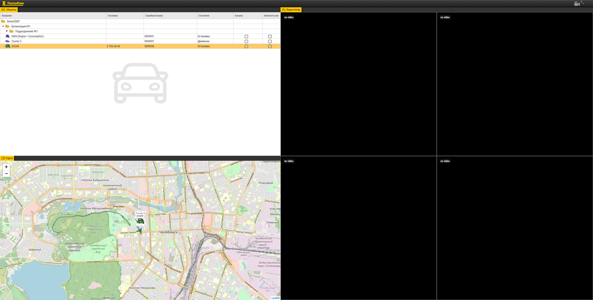
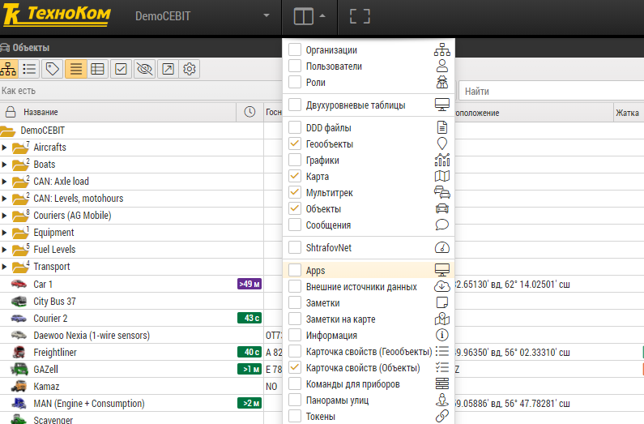
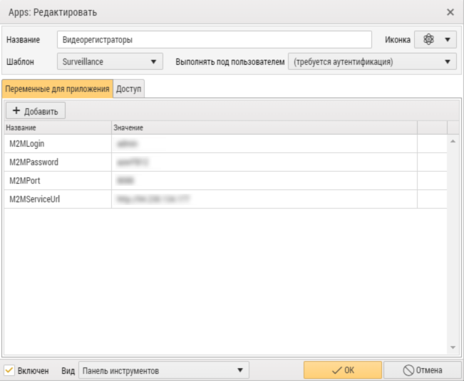
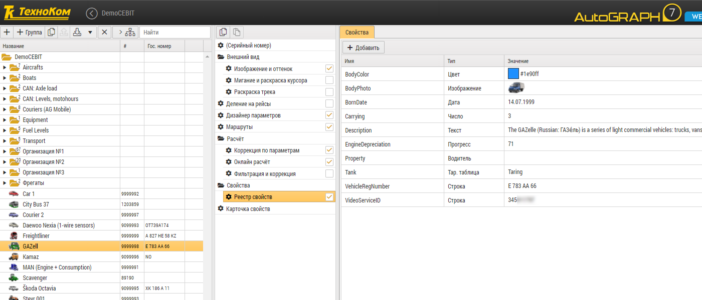
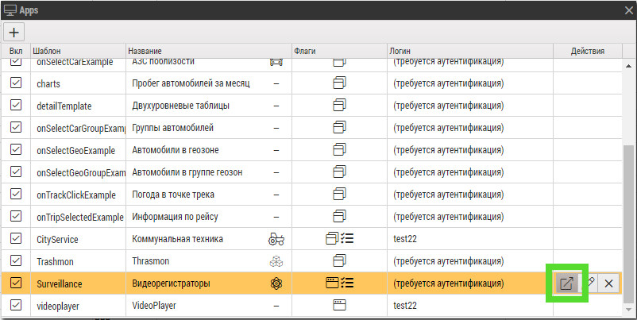

 

  

<h3 align="center">Видеомониторинг</h3>

  
 
Приложение для видеомониторинга транспорта с помощью облачного сервиса М2Медиа

<!-- TABLE OF CONTENTS -->

  
<h2 style="display: inline-block">Содержание</h2>

  <ol>
    <li>
      <a href="#о-проекте">О проекте</a>
    </li>
    <li>
      <a href="#перед-началом">Перед началом</a>
      <ul>
        <li><a href="#установка">Установка</a></li>
      </ul>
    </li>
    <li><a href="#использование">Использование</a></li>
    <li><a href="#контакты">Контакты</a></li>
  </ol>

## О проекте

Приложение "Видеомониторинг" позволяет отслеживать транспорт с видеорегистраторами
компании [М2Медиа](https://www.m2media.ru/) и смотреть онлайн-видео с камер в транспорте.

## Перед началом

Для установки приложения понадобятся адрес, логин и пароль сервиса М2Медиа.

### Установка

Для установки приложения нужен доступ к AutoGRAPH Web под учетной записью администратора.

1. Скопируйте папку с App в AppTemplates.

2. Зайдите в Apps

  
 
    

3. Добавьте новый App и настройки для доступа к сервису М2Медиа:

* **M2MServiceUrl** _обязательный_

> Адрес сервера M2M.

* **M2MPort**

> Порт сервера М2М.

* **M2MLogin** _обязательный_

> Логин сервиса М2М.

* **M2MPassword** _обязательный_

> Пароль сервиса М2М.

   

4. Для всех автомобилей с видеорегистраторами добавьте свойство "VideoServiceID" с идентификатором устройства М2Медиа.

   

5. Откройте App в отдельном окне.

    

<!-- USAGE EXAMPLES -->

## Использование

Приложение будет работать с минимальными правами доступа в организацию (ReadOnly).

Поставьте флаг канала автомобиля, который требуется просмотреть, активируется окно с онлайн-трансляцией данного канала.

<!-- CONTACT -->

## Контакты

E-mail: <a href="mailto:support@tk-chel.ru">support@tk-chel.ru</a>
